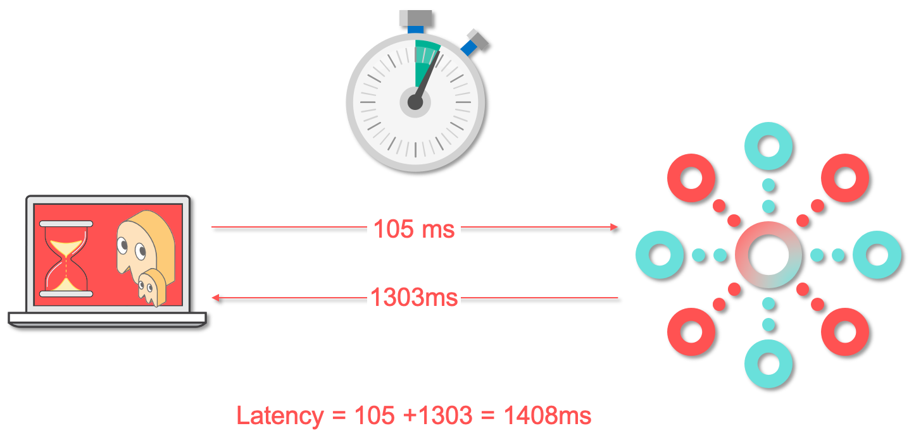
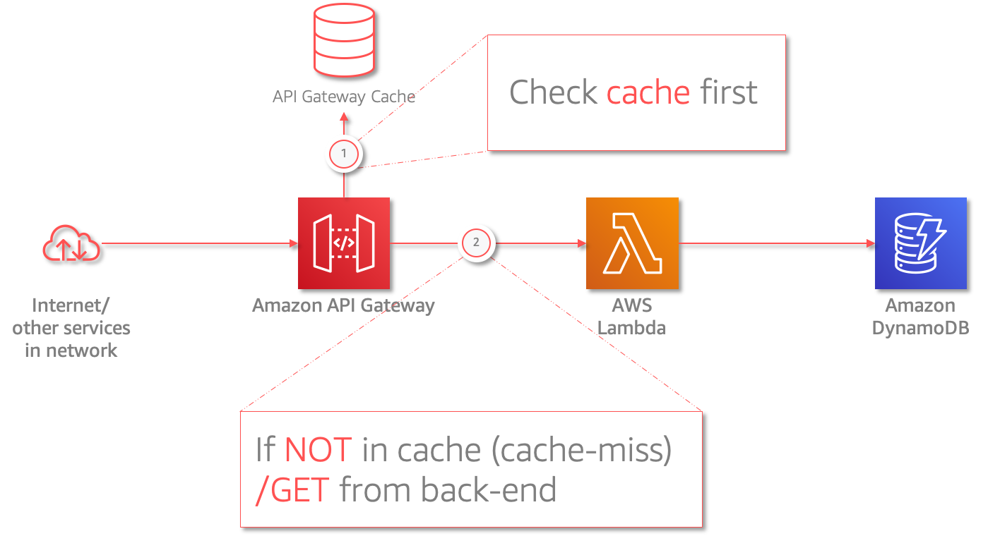
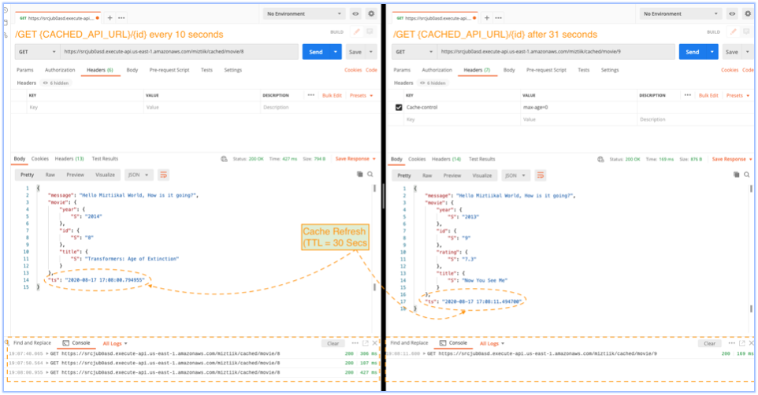
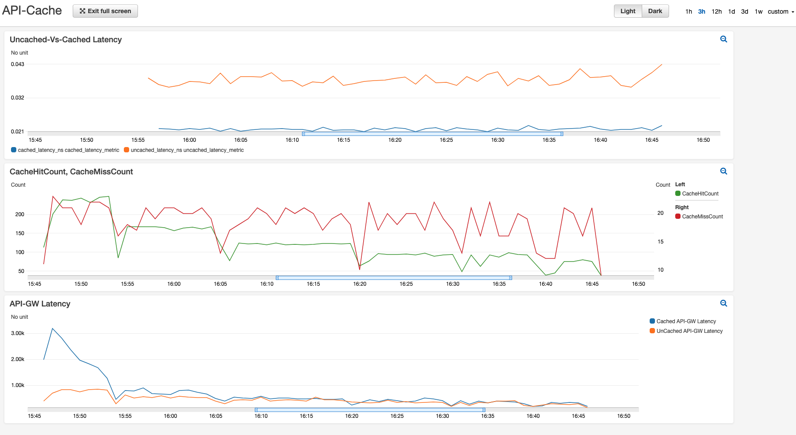

# API Best Practices: Highly Performant API Design

Mystique Unicorn App is a building new application based on microservice architectural pattern. The app provides updates on events in real-time. At any given time, there will be a number of users querying for the same data (Very much like match data of a sporting event). During the event, Mystique corp would like to keep the latency as low as possible and while maintaining the data freshness. Once the event is no longer relevant, the query load on the API will be siginificantly less and latency is not a concern. As an cloud consultant to Mystique Corp, can you help their dev team to maintain _lower latency_ and _data freshness_ of their app?



## 🎯Solutions

Ideally, an API request is RESTful, i.e. it makes use of HTTP semantics. Read requests are made using the GET method, authentication credentials are included via a header, and reads are broken down into small, atomic chunks. HTTP is designed to facilitate caching.

In-memory data caching can be one of the most effective strategies to improve your overall application performance and to reduce your database costs. By caching reusable data among requests, We can ensure the application running on the edge is able to maintain lower latency. Every cache requires local storage and content needs to be loaded into memory cache memory.

If the rate of change of the data is very high, then cache will become stale at the same rate. It is important to choose the appropriate cache invalidation strategies. Setting _Time-To-Live(TTL)_ is one common way of invalidation. With API Gateway caching, you can cache responses to any request, including POST, PUT and PATCH. _However, this is not enabled by default._



In this article, we will build the above architecture. using Cloudformation generated using [AWS Cloud Development Kit (CDK)][102]. The architecture has been designed in a modular way so that we can build them individually and integrate them together. The prerequisites to build this architecture are listed below

1.  ## 🧰 Prerequisites

    This demo, instructions, scripts and cloudformation template is designed to be run in `us-east-1`. With few modifications you can try it out in other regions as well(_Not covered here_).

    - 🛠 AWS CLI Installed & Configured - [Get help here](https://youtu.be/TPyyfmQte0U)
    - 🛠 AWS CDK Installed & Configured - [Get help here](https://www.youtube.com/watch?v=MKwxpszw0Rc)
    - 🛠 Python Packages, _Change the below commands to suit your OS, the following is written for amzn linux 2_
      - Python3 - `yum install -y python3`
      - Python Pip - `yum install -y python-pip`
      - Virtualenv - `pip3 install virtualenv`

1.  ## ⚙️ Setting up the environment

    - Get the application code

      ```bash
      git clone https://github.com/miztiik/secure-api-with-throttling.git
      cd secure-api-with-throttling
      ```

1.  ## 🚀 Prepare the dev environment to run AWS CDK

    We will cdk to be installed to make our deployments easier. Lets go ahead and install the necessary components.

    ```bash
    # If you DONT have cdk installed
    npm install -g aws-cdk

    # Make sure you in root directory
    python3 -m venv .env
    source .env/bin/activate
    pip3 install -r requirements.txt
    ```

    The very first time you deploy an AWS CDK app into an environment _(account/region)_, you’ll need to install a `bootstrap stack`, Otherwise just go ahead and deploy using `cdk deploy`.

    ```bash
    cdk bootstrap
    cdk ls
    # Follow on screen prompts
    ```

    You should see an output of the available stacks,

    ```bash
    uncached-api
    cached-api
    ```

1.  ## 🚀 Deploying the application

    Let us walk through each of the stacks,

    - **Stack: uncached-api**
      We are going to deploy a simple api running as a lambda function. This API is deployed as public endpoint without any caching. When the api is invoked, The backend processess the request and does two things:

      - Returns an movie item data
      - Add the request processed timestamp to the response

      There are two api resources available for us,

      - `{UNCACHED_API_URL}` - Every invocation will return a random movie item data
      - `{UNCACHED_API_URL}/{id}` - As this is a sample, there are only _10_ movies in the database.You can also invoke query the database for a movie by providing an _id_. The _id_ value can be between `{0..9}`

      Initiate the deployment with the following command,

      ```bash
      cdk deploy uncached-api
      ```

      _Expected output:_
      The `UncachedApiUrl` can be found in the outputs section of the stack,

      ```bash
      $ UNCACHED_API_URL="https://x60fl6u8f7.execute-api.us-east-1.amazonaws.com/miztiik/uncached/movie"
      $ curl ${UNCACHED_API_URL}
        {
          "message": "Hello Miztiikal World, How is it going?",
          "movie": {
            "year": {
              "S": "2013"
            },
            "id": {
              "S": "3"
            },
            "title": {
              "S": "Thor: The Dark World"
            }
          },
          "ts": "2020-08-16 21:55:09.887050"
        }
      # Queryiing on movie id
      $ curl ${UNCACHED_API_URL}/9
        {
          "message": "Hello Miztiikal World, How is it going?",
          "movie": {
            "year": {
              "S": "2013"
            },
            "id": {
              "S": "9"
            },
            "rating": {
              "S": "7.3"
            },
            "title": {
              "S": "Now You See Me"
            }
          },
          "ts": "2020-08-16 21:53:49.432507"
        }
      ```

      As you make multiple queries to the API, You can observe that the timestamp changes for each invocation. This shows that each of the request invokes the backend lambda(_You can also check the lambda execution logs in cloudwatch._). We also can make a note of the latency for each of the request by prefixing our bash commands with `time` or using an utility like `Postman`.


      ```bash
      # Queryiing on movie id
      $ curl ${UNCACHED_API_URL}/9
      {
        "message": "Hello Miztiikal World, How is it going?",
        "movie": {
          "year": {
            "S": "2013"
          },
          "id": {
            "S": "9"
          },
          "rating": {
            "S": "7.3"
          },
          "title": {
            "S": "Now You See Me"
          }
        },
        "ts": "2020-08-16 22:13:24.994078"
      }
      real    0m1.482s
      user    0m0.025s
      sys     0m0.017s
      ```

      Here you can observe the latency varies between `300`ms to `1400`ms. This is what we want to avoid and optimize our api so that we can provide consisitent user experience.

    - **Stack: cached-api**

      This stack:_cached-api_ is very much similar to the previous stack. In addition to that, We will also add caching. To observe the benefit of caching, we will enable it on only one of the resources, this also demonstrats the ability of API Gateway to allow granular caching.

      - Caching **OFF**: `{CACHED_URL}` - When this url is invoked, we get a random movie item data, but the response is _not_ cached. Every request is passed onto the backend for processing
      - Caching **ON**: `{CACHED_URL}/{id}` - On invocation, returns the movie item for the given `{id}` and _caches_ the response. When an request for the same `{id}` comes along within the TTL the request is served from cache.

        - _Customizations_: You can change the `TTL` value and the cache size. In this demo,
          - `TTL` = 30Seconds
          - `Cache Size` = 0.5GB


          Try changing them to see how it impacts the performance of your API.

      Initiate the deployment with the following command,

      ```bash
      cdk deploy cached-api
      ```

      Check the `Outputs` section of the stack to access the `CachedApiUrl`

1.  ## 🔬 Testing the solution

    We can use a tool like `curl` or `Postman` to query the url and measure the response time. The _Outputs_ section of the respective stacks has the required information on the urls

    The sample script below will generate requests for `31` seconds(\_Remember our `TTL` is `30` seconds) . We can clearly observe that the timestamp `ts` value in all the requests are the same until the `TTL` expires the cache. As soon as the cache expires, the `ts` value changes. If you do that same loop with the `UNCACHED_API_URL`, you can observe that the `ts` value changes for every request.

    ```bash
    curl -H "Cache-control: max-age=0" "${CACHED_API_URL}" - This should print a timestamp that changes every second you run it, because the Cache-Control header is being respected despite the fact that requireAuthorizationForCacheControl is true. This is NOT expected
    ```

    ```bash
    CACHED_API_URL="https://srcjub0asd.execute-api.us-east-1.amazonaws.com/miztiik/cached/movie/9"
    runtime=31
    now=$(date +%s)
    future=$((now+runtime))
    while [ $(date "+%s") -le $future ]
    do
    curl ${CACHED_API_URL}
    echo -e "=== `date +%s` ==="
    done
    ```

    If we can do the same testing on `postman` we can notice latency values as well,

    


    We can also measure the end-user latency using `curl` and push the log metrics to cloudwatch and let cloudwatch generate the graphs.

    

    |Metric|Description|
    |-|-|
    |`CacheHitCount`|The number of requests served from the API cache.|
    |`CacheMissCount`|The number of requests served from the back end when API caching is enabled.|
    |`IntegrationLatency`|The time in milliseconds between when API Gateway relays a request to the back end and when it receives a response from the back end.|
    |`Latency`|The time in milliseconds between when API Gateway receives a request from a client and when it returns a response to the client. The latency includes the integration latency and other API Gateway overhead.|

    _Additional Learnings:_ You can check the logs in cloudwatch for more information or increase the logging level of the lambda functions by changing the environment variable from `INFO` to `DEBUG`

1.  ## 📒 Conclusion

    As you can see from the above graphs, the improvements are significant, and you can get these same benefits for your API today. It's easy to get started with API Caching, But cacheability will vary widely across your portfolio of APIs. It is critical to design and implement a caching strategy on an individual API basis based on your application requirements. They key question _What should be cached?_ to consider here can be helped with the following pointers,

    - Any resource accessible via `HTTP GET`
    - Static data
    - Responses that change rarely or at predictable intervals
    - Responses used by many clients (high volume data)

1.  ## 🧹 CleanUp

    If you want to destroy all the resources created by the stack, Execute the below command to delete the stack, or _you can delete the stack from console as well_

    - Resources created during [Deploying The Application](#deploying-the-application)
    - Delete CloudWatch Lambda LogGroups
    - _Any other custom resources, you have created for this demo_

    ```bash
    # Delete from cdk
    cdk destroy

    # Follow any on-screen prompts

    # Delete the CF Stack, If you used cloudformation to deploy the stack.
    aws cloudformation delete-stack \
        --stack-name "MiztiikAutomationStack" \
        --region "${AWS_REGION}"
    ```

    This is not an exhaustive list, please carry out other necessary steps as maybe applicable to your needs.

## 📌 Who is using this

This repository aims to teach how to improve your api performance with caching to new developers, Solution Architects & Ops Engineers in AWS. Based on that knowledge these Udemy [course #1][103], [course #2][102] helps you build complete architecture in AWS.

### 💡 Help/Suggestions or 🐛 Bugs

Thank you for your interest in contributing to our project. Whether it's a bug report, new feature, correction, or additional documentation or solutions, we greatly value feedback and contributions from our community. [Start here][200]

### 👋 Buy me a coffee

[](https://ko-fi.com/Q5Q41QDGK)Buy me a [coffee ☕][900].

### 📚 References

1. [API Gateway Caches are local to regions][1]

1. [Find latency of requests to edge-optimized API][2]

1. [Using `curl` for latency measurement][3]

1. [AWS Whitepaper: Database Caching Strategies Using Redis][4]

1. [API Gateway VTL mapping template reference][5]

1. [Delete stack that is stuck in the `DELETE_FAILED` status][6]

1. [Fix Lambda-backed custom resource's stuck in `DELETE_FAILED` status or `DELETE_IN_PROGRESS`][7]

### 🏷️ Metadata

**Level**: 300


[1]: https://forums.aws.amazon.com/thread.jspa?threadID=195290#646425
[2]: https://aws.amazon.com/premiumsupport/knowledge-center/source-latency-requests-api-gateway/
[3]: https://github.com/awslabs/aws-support-tools/blob/master/APIGateway/Tools/curl_for_latency/curl_for_latency.sh
[4]: https://d0.awsstatic.com/whitepapers/Database/database-caching-strategies-using-redis.pdf
[5]: https://docs.aws.amazon.com/apigateway/latest/developerguide/api-gateway-mapping-template-reference.html
[6]: https://aws.amazon.com/premiumsupport/knowledge-center/cloudformation-stack-delete-failed/
[7]: https://aws.amazon.com/premiumsupport/knowledge-center/cloudformation-lambda-resource-delete/
[100]: https://www.udemy.com/course/aws-cloud-security/?referralCode=B7F1B6C78B45ADAF77A9
[101]: https://www.udemy.com/course/aws-cloud-security-proactive-way/?referralCode=71DC542AD4481309A441
[102]: https://www.udemy.com/course/aws-cloud-development-kit-from-beginner-to-professional/?referralCode=E15D7FB64E417C547579
[103]: https://www.udemy.com/course/aws-cloudformation-basics?referralCode=93AD3B1530BC871093D6
[200]: https://github.com/miztiik/secure-api-with-throttling/issues
[899]: https://www.udemy.com/user/n-kumar/
[900]: https://ko-fi.com/miztiik
[901]: https://ko-fi.com/Q5Q41QDGK
